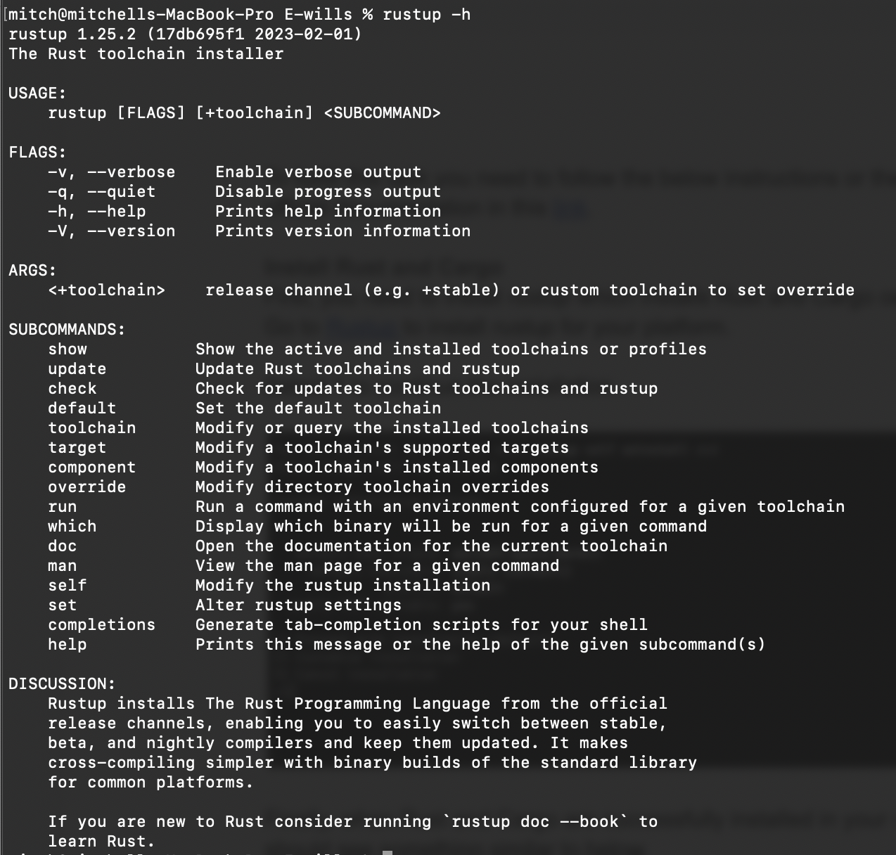
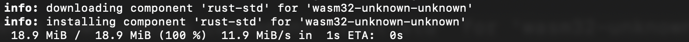
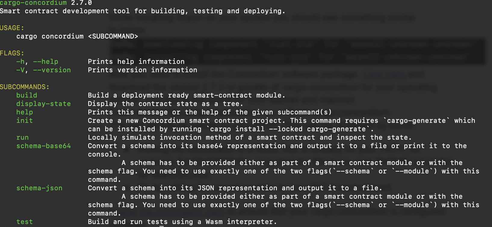
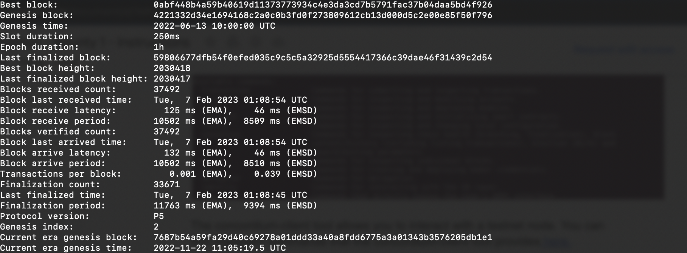
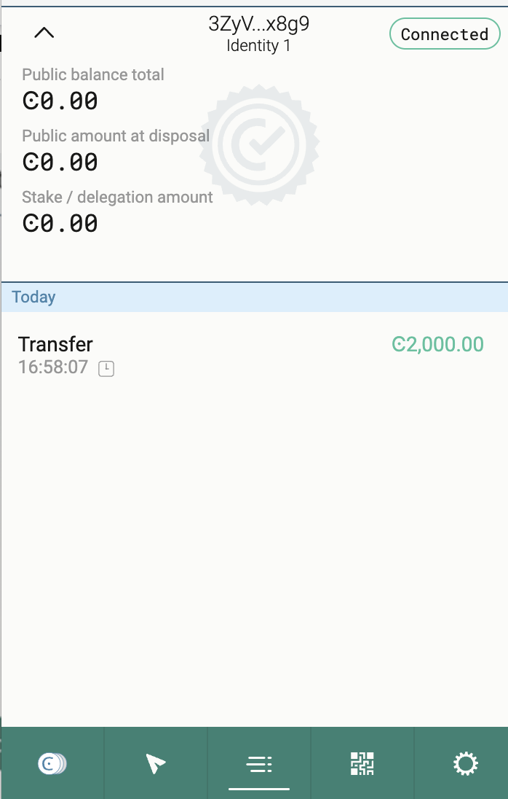
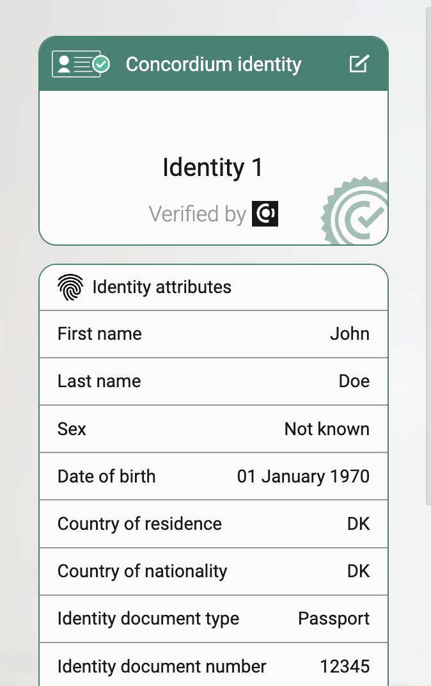
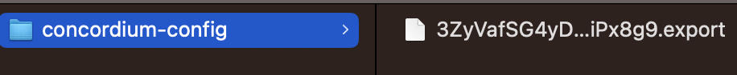
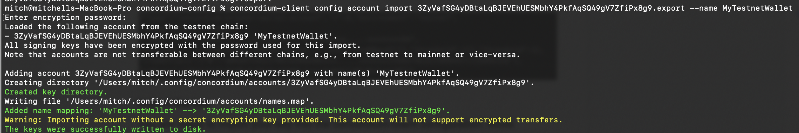

# Concordium Hackathon Task 1

## Install Rust and Cargo Concordium

Navigatie over to the [Rust](https://rustup.rs/) home page and install for your system. To check if you have Rust already installed open a terminal and run the following command.

    rustup -h

Next install Wasm which will be used for building contracts.

    rustup target add wasm32-unknown-unknown

Output should look like the following.

Install Cargo Concordium & check install.

[Download Cargo Concordium](https://developer.concordium.software/en/mainnet/net/installation/downloads-testnet.html#cargo-concordium-testnet)

Open a ternimal, change permissions & file location to cargo bin.

    sudo chmod +x cargo-concordium
    mv cargo-concordium ~/.cargo/bin

Check if Cargo Concordium is installed correctly by running the following command.

    cargo concordium --help 

## Install Concordium Client 

Download [Concordium client](https://developer.concordium.software/en/mainnet/net/installation/downloads-testnet.html#concordium-node-and-client-download-testnet) and following the install process.

Check Install and testnet node by running the following command.

     concordium-client consensus status --grpc-port 10000 --grpc-ip node.testnet.concordium.com  

## Setup testnet wallet and add liquidity

Download web browser extension, create a identity on the testnet and add liquidity.

## Export wallet to Concordium Client

Within the brower extension you will be able to export your wallet.

Import the wallet into the Concordium Client with a following command. 

    concordium-client config account import <YOUR PUBLIC ADDRESS.export> --name <Your-Wallet-Name>

The output should look similar to the following.

# Mainnet Address

    34Aj12Gg6xgzrVRE6jLzcUD8T8FmHVygDeT4oDDZPBSpNmPjj4

