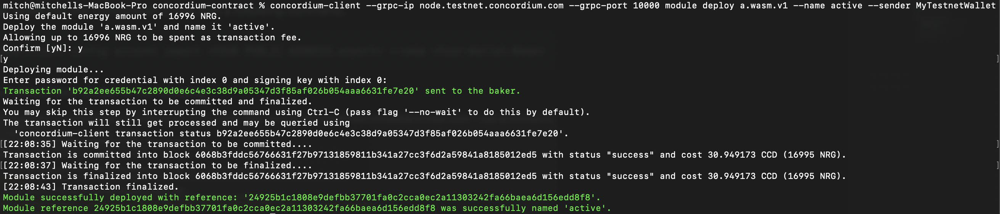
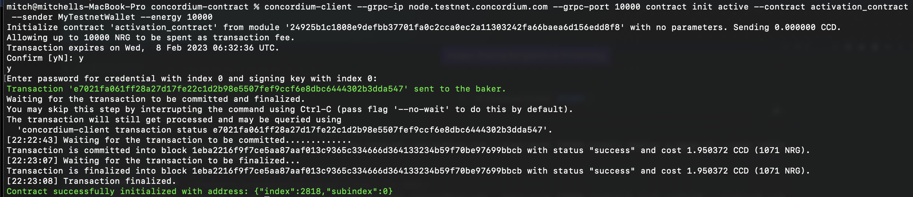
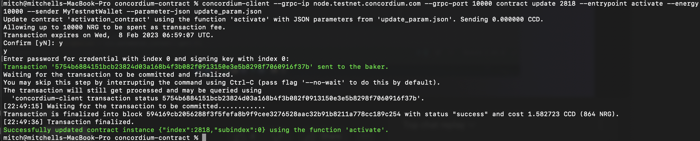
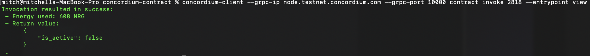

# Task 2 Deploy Your First Smart Contract

Deployed contract is very basic containing a single receive function named `activate`. Activate take a single boolean parameter and used to set a contract state variable called `is_active`. `is_active` is set during initialization to the `true`  state then changed to `false` during updating. The update can be viewed by using the `invoke` command with concordium-client.

## Smart contract deployment

Command 

    concordium-client --grpc-ip node.testnet.concordium.com --grpc-port 10000 module deploy a.wasm.v1 --name active --sender MyTestnetWallet

Transaction Hash

    b92a2ee655b47c2890d0e6c4e3c38d9a05347d3f85af026b054aaa6631fe7e20



Reference 

    24925b1c1808e9defbb37701fa0c2cca0ec2a11303242fa66baea6d156edd8f8

## Smart contract init

Command 

    concordium-client --grpc-ip node.testnet.concordium.com --grpc-port 10000 contract init active --contract activation_contract  --sender MyTestnetWallet --energy 10000 

    e7021fa061ff28a27d17fe22c1d2b98e5507fef9ccf6e8dbc6444302b3dda547



## Smart contract update 

Command

    concordium-client --grpc-ip node.testnet.concordium.com --grpc-port 10000 contract update 2818 --entrypoint activate --energy 10000 --sender MyTestnetWallet --parameter-json update_param.json


Input file `update_param.json`

```js
{
    false
}
```


    5754b6884151bcb23824d03a168b4f3b082f0913150e3e5b8298f7060916f37b



## contract invoke

Command 

    concordium-client --grpc-ip node.testnet.concordium.com --grpc-port 10000 contract show 2818





## Mainnet 

    34Aj12Gg6xgzrVRE6jLzcUD8T8FmHVygDeT4oDDZPBSpNmPjj4