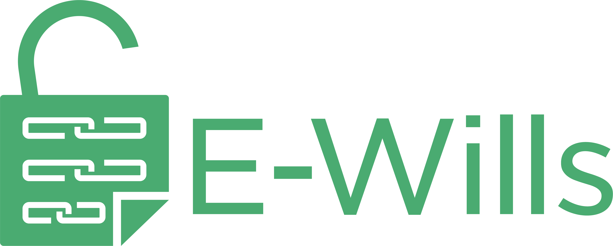
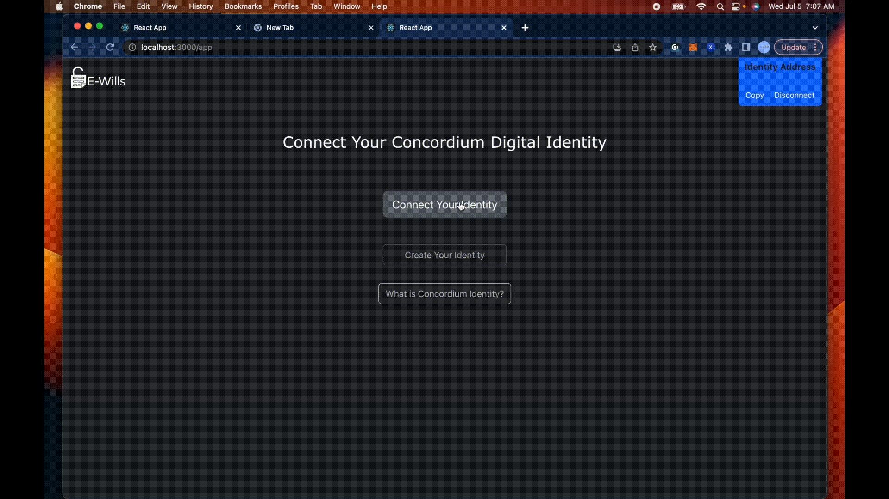
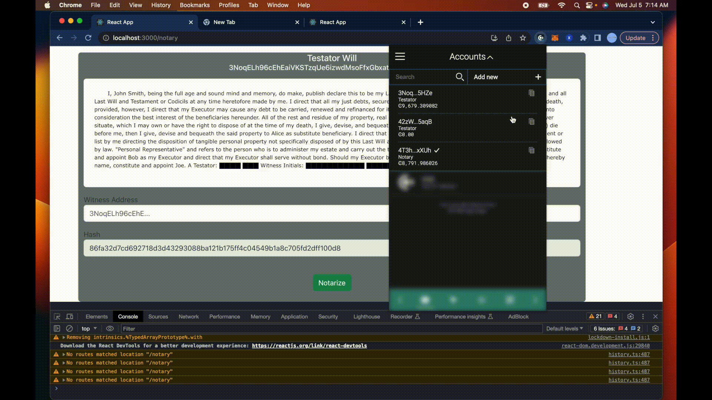

E-Wills is the next generation of Will notarization, verification & discovery powered by a smart contract on the Concordium blockchain.

---
  * [About](#about)
  * [Concordium Wallet](#concordium-wallet)
  * [Requirements](#requirements)
  * [How it works](#how-it-works)
  * [Quick Start](#quick-start)
    + [1. Download and install](#1-download--install)
    + [2. Compiling & deploying E-Will Contract](#2-optional-compiling--deploying-e-will-contract)
    + [3. Start the dapp](#3-start-the-dapp)
    + [4. Conncting your Concordium Browser Wallet](#4-conncting-your-concordium-browser-wallet)
    + [5. Minting a will as a digital Asset](#5-minting-your-will-as-a-digital-asset)
    + [6. Will notarization](#6-e-will-notarization)
    + [7. Will Burning](#7-e-will-burning)
  * [Licence](#licence)

---

## About 

This project is part of the Building The Future Of ID hackathon sponsored by Concordium Blockchain. With the goal of creating the next generation of use cases that have ID, privacy, and accountability at their core.

## Concordium Wallet

    34Aj12Gg6xgzrVRE6jLzcUD8T8FmHVygDeT4oDDZPBSpNmPjj4

## Requirements

***Note: check out branches task 1 | 2 for more details on setup requirements, also recommended watch Concordium's in-depth how to.***

[Concordium Overview](https://www.youtube.com/live/a8xxo4c_5CM?feature=share)

[Building Smart Contracts](https://www.youtube.com/live/T9_xmh6Vja4?feature=share)

[Building dApps](https://www.youtube.com/live/J-SP_ptKu_I?feature=share)

---

* Git v2.32.0^
* Nodejs v16.17.0^
* npm 9.2.0^
* [Concordium Browser Wallet](https://chrome.google.com/webstore/detail/concordium-wallet/mnnkpffndmickbiakofclnpoiajlegmg?hl=en-US)

**Optional**
* Rustup 1.25.2
    * wasm32
* Cargo
    * [cargo-concordium](https://developer.concordium.software/en/mainnet/net/installation/downloads-testnet.html#cargo-concordium-v2-7-0)
* [Concrodium-client](https://developer.concordium.software/en/mainnet/net/installation/downloads-testnet.html#concordium-node-and-client-download-testnet)

---

## How It works

<b>Terminology</b>

<b>Testator </b>: A person who has made a will.

<b>Notary</b> : A impartial witness to the signing of a legal document.

<b>Witness</b> : A individual who personally knows the signer and can vouch for the signer's identity to the Notary.

### Creation

The testator starts the process by calling the smart contract `mint` method taking in three arguments; will url, hash of the will & the notary address. Values are saved within the contract state and mapped to the testator address, representing ownership. A testator can only own a single immutable E-Will and must be burned to create a new instance. In this state, the will is invalid and will need to be notarized.

### Notarization & Verification

Trustator grants permission to a notary to allow the notarization of the E-Will. After the notary witnesses the remote 'Will' notarization. The notary will confirm the E-Will By calling the `notarize` method in the smart contract. The `notarize` method takes in three arguments; will url, hash of the will & witness address. The smart contract will verify the inputs and create an `Eseal`. `Eseal` is a blockchain-based verification and fraud protection process that assures the authenticity of a document and validation. The Eseal can be verified at any time.

### Discovery

The discovery of a E-Will relies heavily on a feature only known to the Concordium Block called `revoking anonymity`. Where an identity of a user can only be revealed to a qualified authority as part of a valid legal process. A qualified authority is a governmental body that has authority to act in a relevant jurisdiction. In such cases of an deceased relative, a judge would need to graint a court order to reveal the identity of the decease. This discloses ownership of a E-Will, that would be presented to the court showing authenticity and validation. Additionally the judge could reveal identitys of the notary and witness.

## Quick Start

[Quick start & Dapp Walk Through video](https://youtu.be/yxFT_i2EiZw)

[Only Dapp Walk Through video](https://youtu.be/yxFT_i2EiZw?t=469)

### 1. Download & install

Open your terminal and git clone the repo.

    git clone https://github.com/MitchTODO/E-Wills.git

`cd` into the repo directory

    cd E-Wills

### 2. (**Optional**) Compiling & deploying E-Will Contract

This section is optional as the dapp uses a predeployed E-Wills contract on the Concordium testnet. Please defer to the [quick start video](https://youtu.be/yxFT_i2EiZw) for how this process is done.

### 3. Start the dapp

`cd` into the demo directory

    cd demo

Install `npm` packages, wait until complete.

    npm install 

Start the live-server with the following command.

***Note: You will need a browser open as it will be used to view the dapp.***

    npm start

You should be present with the following within your brower.

### 4. Conncting your Concordium Browser Wallet

Within the dapp press the connect wallet button. You will then to confirm the connection of your wallet address. 

Once connected the dapp checks if the address ownes an E-will within the contract. If so, contents of that E-will are then requested and presented. Otherwise the user is presented with the will creation view. 

### 5. Minting your 'Will' as a digital asset

***Note: You will need testnet tokens in order to write to the smart contract.***

Minting takes in three inputs.

- `Will File Url` : The digital storage location of the 'will'.

For this demo I use a mock 'will' text file uploaded to the Github repo and set to be the default url within the dapp.

- `Will Hash` : SHA-256 Hash of the 'will' file. 

The file hash is generated by pressing the `Get` button. This requests the file and hashes the contents.

- `Notary Address` : Address authorized to notarize the 'will'.

Notary address must be different from the sender address. Therefor create and use another address within the wallet.

### 6. E-Will notarization

In order for the 'will' in be succeussfully notorized we must switch to the address that was given authorization. Once are notary address is connected to the dapp we can continue to the notary view by toggling the notary view button. Presented with an input view we then paste the address of the 'will' owner. As each will is mapped to the address who created it.

 Notarization takes in one input parameter from the notary and additional parameters are passed into the contract method during transaction initialization (will hash & will id).

 - `Witness` : Address of the Identity who witness the notarization.

 - `Will Hash` : Current SHA-256 hash of the 'will' file. 

 - `Will Id` : Address of the owner of the E-Will being notarized.

Once the transaction finishes we can refesh the E-Will and find that it has been successfully notortized and Esealed.

### 7. E-Will Burning 

An address can only possess a single immutable E-Will. Therefore the user must burn the exsiting E-Will inorder to make changes or modifier, thus repeat the notization process. 

## Licence

The project is available under [Apache licence](https://github.com/MitchTODO/E-Wills/blob/main/LICENSE)

